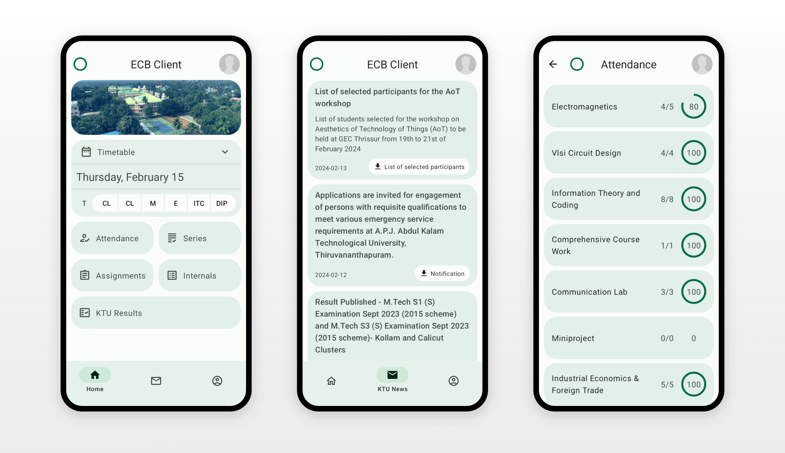

# ecb-client

**ECB Client** is an application designed for students of TKMCE (KTU batch) to conveniently access details from both Etlab and KTU.
It is built using the modern and efficient Jetpack Compose framework ([https://developer.android.com/jetpack/compose](https://developer.android.com/jetpack/compose)).

## Etlab details
The official Etlab application, uses an API to get details.
Its not straight forward to inspect the API calls made by this app, and also, their API service can sometimes go down.

This application instead fetches the HTML page from the Etlab website directly and parses its contents.
This approach has many drawbacks but will suffice for normal usage.

[Jsoup library](https://jsoup.org/) is used for making the connection and for parsing HTML content.
Retrieved contents are then stored in a local database for offline usage.

The following Etlab features have been implemented:
- Timetable
- Attendance (by subject)
- Profile Details

The following features are planned to be added:
- Internals
- Series
- Notification badges
- Assignments
- TKMCE Banners
- Survey (auto completion)
> ^ You could contribute to these. PRs are welcome.

## KTU Details
Apart from Etlab contents, the application also shows some details from KTU.
These are fetched through the KTU API.
Connections are made using Jsoup library.

The following contents are fetched by this application:
- **Exam results** (B.Tech)
    - API used by this page: https://ktu.edu.in/Exam/result
    - Uses `Reg No` and `Date of Birth` from your Etlab profile to fetch results.
- **Announcements**
    - API used by this page: https://ktu.edu.in/Menu/announcements
    - Currently, only fetches the latest 20 notifications.
    - Attachment support has not been implemented yet.

## Contributing
Contributions are welcome to this project in various forms, including UI improvements, feature additions, and bug fixes.

If you are new to Android development, consider following the recommended learning path (https://developer.android.com/courses/android-basics-compose/course) to equip yourself with the necessary skills. Upon completing Unit 4, you'll be able to contribute to the UI, and after Unit 6, you'll be prepared to contribute to the app's underlying functionalities.
